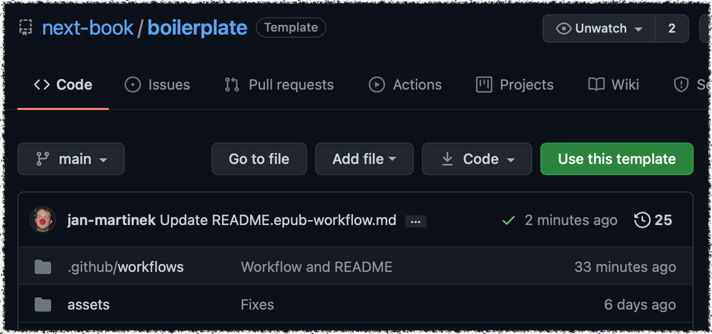
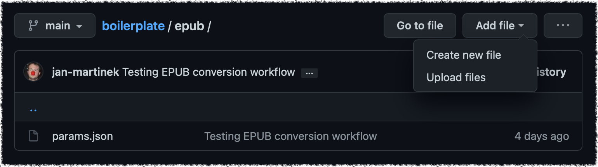
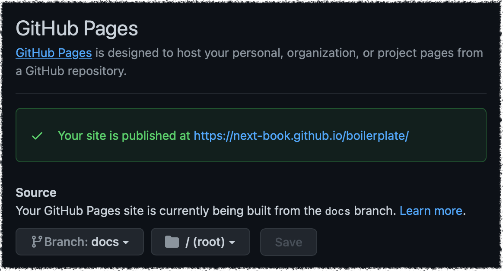

# Konvertor z EPUBu do webové knihy

_Tento návod obsahuje jen základní informace psané na míru pro tým MKP. Podrobnější manuál chystáme._

## Rychlé odkazy

- šablona [github.com/next-book/boilerplate](https://github.com/next-book/boilerplate)
- seznam knih [books-are-next.github.io](https://books-are-next.github.io)

## Postup

### 1. Účet ve službě Github

Vytvořte si účet ve službě [github.com](https://github.com) a pošlete své uživatelské jméno [Honzovi](mailto:honza.martinek@gmail.com), přidá vás do organizace [books-are-next](http://github.com/books-are-next/), kde vznikají konvertované knihy.

### 2. Vyberte si knihu

Stáhněte si knihu z katalogu MKP ve formátu EPUB, nejlépe nějakou z let 2019 a pozdějších (používají stabilnější definice stylů).

### Vytvořte pro novou knihu nový repozitář

1. Ve webovém protředí Github se přepneme do šablony webových knih [next-book/boilerplate](https://gitHub.com/next-book/boilerplate).
2. Vytvořte nový repozitář ze šablony klikem na tlačítko “Use this template” (viz obrázek). Pokud tlačítko nevidíte, nejspíše nejste přihlášeni — přihlaste se ke svému účtu ve službě GitHub.
3. Zvolte umístění (organizace _books-are-next_) a pojmenujte nový repozitář ve formátu jméno-příjmení-autora_název-knihy. Repozitář nastavte jako veřejný (public).

### Nahrávání knihy

V nově vytvořeném repozitáři nahrajte soubor EPUB (Add file → Upload files) do složky epub (viz Obrázek 2). Potvrďte uložení změn tlačítkem “Commit changes”.

### Nastavení exportu knihy

U daného repozitáře zvolíme v horním menu „Settings“ a přesuneme se do položky „Pages“ v podmenu. U položky Source v sekci GitHub Pages a nastavíme „Branch: docs“ a uložíme tlačítkem „Save“ (druhá kolonku ponecháme na hodnotě „/ (root)”).

Po chvíli se zobrazí zelený pruh s informací, že kniha byla publikována.

### Jak omkrnout knihu

Odkazy na exportované knihy jsou nejlépe k nalezení v [seznamu knih](https://books-are-next.github.io). Knihy se ukládají do počítače, aby je bylo možné číst v offline režimu — proto je pro náhled na aktuální knihu potřebné použít anonymní okno (pokud uděláte knize změny, uvidíte nejspíš starší verzi knihy).

Najdete zde odkazy na

- **repo** — samotný repozitář s uloženou knihou
- **actions** — záložka v repozitáři, kde je vidět proces generování knih (zásadní jsou červené puntíky a zelené fajfky, které indikují úspěch konverze)
- **book** — vygenerovaná kniha
- **converter** — rozhraní konvertoru pro doplnění detailů knihy

### Jak upravit vygenerovanou knihu?

Konvertor se snaží vytáhnout co nejvíce informací ze samotného EPUBu, ale některé informace je nutné doplnit: týká se to především struktury obsahu a metadat. K tomu můžete použít rozhraní konvertoru (viz odkaz v předchozí sekci).

Nejdůležitější funkcionalita konvertoru je následující:

- na úvodní straně „Metadata“ můžete editovat… metadata
- na stránce „Structure“ můžete upravit strukturu obsahu, vyznačit titulní a předělové stránky apod.
- na stránce „Export“ pak zkopírujete data, která uložíte do souboru v repozitáři — přímo u textového pole najdete odkaz na příslušný soubor

Podrobný manuál ke všem funkcím tohoto rozhraní ještě ladíme a bude užitečné na něj mrknout, až zvládneme základy. Prozatím je rozpracovaná verze viditelná na [google docs](https://docs.google.com/document/d/1tInPQbpaxHQo6k-c28HofrV3BUm7rTjjj-BrNQ5jGLo/edit).
